# **Curso Digital - Front-end em React**

## **HTML e CSS**

**Módulos**

1.  **Instalações** - 67 Minutos

    **Exercício 1**

2.  **Arquitetura Cliente-Servidor para WEB** - 52 Minutos

    **Exercício 2**

3.  **HTML básico** - 68 Minutos

    **Exercício 3**

4.  **HTML Layout** - 87 Minutos

    **Exercício 4**

5.  **Projeto Página estática** - 79 Minutos

  

# **1. INSTALAÇÕES**

## **Aula 01: Introdução**

**Principais tecnologias e ferramentas**

Essa aula é uma introdução para toda a trilha desse curso, explicando o
que é Front-end e seguindo desde os fundamentos do HTML, CSS,
JavaScript, TypeScript, Node até o finalmente React.

**O que é Front-end?**

Em termos simples, o **front-end** é a parte de um site ou aplicação que
o usuário vê e interage diretamente. É a interface gráfica que você
utiliza para navegar em uma página da web, preencher formulários,
assistir vídeos, etc. Tudo o que você visualiza e clica em um site faz
parte do front-end.

**Tecnologias Essenciais:**

As tecnologias principais utilizadas no desenvolvimento front-end são:

-   **HTML (HyperText Markup Language):** A estrutura básica de uma
    página web. Define a hierarquia dos elementos (cabeçalhos,
    parágrafos, imagens, etc.).

-   **CSS (Cascading Style Sheets):** Responsável por estilizar a
    aparência da página, definindo cores, fontes, layout e
    posicionamento dos elementos.

-   **JavaScript:** Uma linguagem de programação que adiciona
    interatividade às páginas, permitindo criar animações, manipular o
    DOM (Document Object Model) e responder a ações do usuário.

**O que faz um desenvolvedor front-end?**

Um desenvolvedor front-end é o profissional responsável por criar e
manter a interface de um site ou aplicação. Suas principais tarefas
incluem:

-   **Criar interfaces visuais:** Transformar designs em código HTML,
    CSS e JavaScript.

-   **Garantir a responsividade:** Fazer com que a interface se adapte a
    diferentes tamanhos de tela (desktop, tablet, celular).

-   **Melhorar a experiência do usuário:** Tornar a navegação intuitiva
    e agradável.

-   **Otimizar o desempenho:** Garantir que a página carregue
    rapidamente e funcione de forma suave.

**Por que aprender front-end?**

-   **Alta demanda no mercado de trabalho:** A área de desenvolvimento
    front-end está em constante crescimento, com muitas oportunidades de
    emprego.

-   **Criatividade e design:** Você pode dar vida às suas ideias e criar
    interfaces visuais incríveis.

-   **Tecnologia em constante evolução:** Sempre há algo novo para
    aprender e se manter atualizado.

-   **Versatilidade:** As habilidades de front-end são úteis em diversas
    áreas, como desenvolvimento web, mobile e até mesmo criação de
    jogos.

**Como começar a aprender front-end?**

Existem diversas formas de aprender front-end:

-   **Cursos online:** Plataformas como Udemy, Coursera e a própria
    Alura oferecem cursos completos e abrangentes.

-   **Tutoriais e documentação:** A internet está repleta de tutoriais
    gratuitos e a documentação oficial das tecnologias é uma ótima fonte
    de aprendizado.

-   **Projetos práticos:** A melhor forma de aprender é praticando.
    Comece criando seus próprios projetos e colocando em prática o que
    você aprendeu.

-   **Comunidades:** Participe de fóruns, grupos e comunidades online
    para tirar dúvidas e trocar experiências com outros desenvolvedores.

**Frameworks e bibliotecas populares:**

Para agilizar o desenvolvimento e criar interfaces mais complexas, os
desenvolvedores front-end utilizam frameworks e bibliotecas como:

-   **React:** Uma biblioteca JavaScript para criar interfaces de
    usuário.

-   **Angular:** Um framework JavaScript completo para aplicações web.

-   **Vue.js:** Um framework JavaScript progressivo para criar
    interfaces de usuário.

**Quer aprender mais?**

Se você se interessou por front-end, recomendo que você comece
explorando os conceitos básicos de HTML, CSS e JavaScript. Existem
muitos recursos gratuitos disponíveis na internet para te ajudar nessa
jornada.

**Terminologias em Desenvolvimento de Software: Um Glossário**

Entender a linguagem técnica é fundamental para se aprofundar no mundo
da programação. Cada termo representa um conceito específico e, juntos,
formam a base para a construção de softwares complexos.

Vamos explorar algumas das terminologias mais comuns, desde as mais
básicas até as mais avançadas:

**Conceitos Fundamentais**

-   **Algoritmo:** Sequência lógica de instruções para resolver um
    problema.

-   **Dados:** Informação que é manipulada pelo programa.

-   **Variável:** Espaço na memória para armazenar um dado, cujo valor
    pode mudar durante a execução do programa.

-   **Função:** Bloco de código reutilizável que executa uma tarefa
    específica.

-   **Objeto:** Entidade que possui propriedades (atributos) e
    comportamentos (métodos).

**Paradigmas de Programação**

-   **Programação Imperativa:** Foca em descrever como um programa deve
    executar uma sequência de comandos.

-   **Programação Orientada a Objetos (POO):** Organiza o código em
    objetos que interagem entre si.

-   **Programação Funcional:** Trata a computação como a avaliação de
    funções matemáticas.

-   **Programação Lógica:** Baseada em regras lógicas e na dedução.

**Estrutura de Dados**

-   **Vetor/Array:** Coleção ordenada de elementos do mesmo tipo.

-   **Lista:** Estrutura de dados linear que permite a inserção e
    remoção de elementos em qualquer posição.

-   **Pilha:** Estrutura de dados LIFO (Last In, First Out), onde o
    último elemento inserido é o primeiro a ser removido.

-   **Fila:** Estrutura de dados FIFO (First In, First Out), onde o
    primeiro elemento inserido é o primeiro a ser removido.

-   **Árvore:** Estrutura de dados hierárquica, onde cada nó pode ter
    vários filhos.

-   **Grafo:** Estrutura de dados que representa relações entre objetos.

**Banco de Dados**

-   **SQL:** Linguagem padrão para gerenciar bancos de dados
    relacionais.

-   **NoSQL:** Famílias de sistemas de gerenciamento de bancos de dados
    não relacionais.

-   **Schema:** Estrutura de um banco de dados, definindo as tabelas,
    campos e relações.

**Desenvolvimento Web**

-   **Front-end:** Parte visível de um site ou aplicação, com a qual o
    usuário interage diretamente.

-   **Back-end:** Parte do sistema que não é visível ao usuário,
    responsável pela lógica e processamento de dados.

-   **Full-stack:** Desenvolvedor que domina tanto o front-end quanto o
    back-end.

-   **API:** Interface de Programação de Aplicações, conjunto de regras
    e especificações para a interação entre diferentes softwares.

**Controle de Versão**

-   **Git:** Ferramenta de controle de versão distribuído amplamente
    utilizada.

-   **Branch:** Ramificação do código-fonte para desenvolver novas
    funcionalidades sem afetar a versão principal.

-   **Merge:** Ato de combinar duas ou mais branches em uma única.

-   **Commit:** Salvamento de alterações no código-fonte.

**Outros Termos Comuns**

-   **Bug:** Erro no software.

-   **Debugging:** Processo de encontrar e corrigir bugs.

-   **Framework:** Estrutura que fornece uma base para o desenvolvimento
    de software, oferecendo bibliotecas e convenções.

-   **Biblioteca:** Coleção de funções e classes reutilizáveis.

-   **IDE (Integrated Development Environment):** Ambiente de
    desenvolvimento integrado, que fornece ferramentas para escrever,
    testar e depurar código.

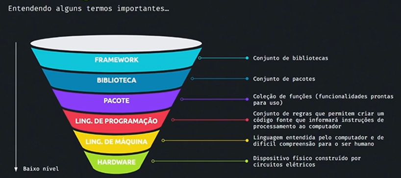

O diagrama acima nos oferece uma visão simplificada, mas eficaz, da
hierarquia de conceitos que fundamentam a construção de software, desde
o nível mais abstrato até o hardware. Vamos destrinchar cada elemento e
suas relações:

**Hardware: A Base de Tudo**

-   **O que é:** É o componente físico do computador, como o
    processador, memória, disco rígido e dispositivos de entrada/saída.

-   **Função:** Fornece a plataforma onde o software é executado.

**Linguagem de Máquina: A Linguagem do Hardware**

-   **O que é:** A forma mais básica de instrução que o computador
    compreende diretamente.

-   **Função:** Instrui o hardware a realizar tarefas específicas, como
    realizar cálculos ou mover dados.

**Linguagem de Programação: A Ponte entre Humanos e Máquinas**

-   **O que é:** Um conjunto de regras e símbolos que permitem aos
    programadores escrever instruções para o computador, de forma mais
    legível para os humanos.

-   **Função:** Abstrai a complexidade da linguagem de máquina, tornando
    a programação mais acessível. Exemplos: Python, JavaScript, C++.

**Pacote: Blocos de Construção Reutilizáveis**

-   **O que é:** Uma coleção de funções ou módulos que oferecem
    funcionalidades específicas, como funções matemáticas, manipulação
    de strings, etc.

-   **Função:** Agrupa funcionalidades relacionadas, facilitando a
    organização e reutilização do código.

**Biblioteca: Uma Coleção de Pacotes**

-   **O que é:** Um conjunto de pacotes relacionados, que oferecem um
    conjunto mais amplo de funcionalidades.

-   **Função:** Fornece um conjunto de ferramentas prontas para uso,
    economizando tempo e esforço dos desenvolvedores.

**Framework: Uma Estrutura Completa**

-   **O que é:** Um conjunto de bibliotecas, ferramentas e convenções
    que fornecem uma estrutura para o desenvolvimento de software.

-   **Função:** Oferece uma base sólida para construir aplicações,
    definindo a arquitetura e as melhores práticas.

**A Relação entre os Elementos**

O diagrama representa uma hierarquia, onde cada nível se baseia no
anterior. Por exemplo:

-   **Linguagens de programação** são utilizadas para criar **pacotes**.

-   **Pacotes** são agrupados em **bibliotecas**.

-   **Bibliotecas** são organizadas dentro de **frameworks**.

-   E assim por diante, até chegarmos ao **hardware**.

**Em resumo:**

-   O **hardware** é a base física.

-   A **linguagem de máquina** é a linguagem nativa do hardware.

-   **Linguagens de programação** permitem que os humanos interajam com
    o computador.

-   **Pacotes** e **bibliotecas** oferecem funcionalidades prontas para
    uso.

-   **Frameworks** fornecem uma estrutura completa para o
    desenvolvimento de software.

**Analogia:**

Imagine construir uma casa. O **hardware** seria o terreno e os
materiais de construção (tijolos, madeira, etc.). A **linguagem de
programação** seria o manual de instruções para construir a casa. Os
**pacotes** e **bibliotecas** seriam os módulos pré-fabricados (portas,
janelas, etc.). E o **framework** seria o projeto arquitetônico que
define a estrutura geral da casa.

**O que esse diagrama significa para você:**

Ao entender essa hierarquia, você compreende melhor como os diferentes
componentes de um software se relacionam e como eles são construídos.
Isso é fundamental para:

-   **Escolher as ferramentas certas:** Saber qual linguagem de
    programação, framework ou biblioteca utilizar para um determinado
    projeto.

-   **Resolver problemas:** Ao entender a estrutura do software, você
    pode identificar a causa de um problema mais facilmente.

-   **Aprender novas tecnologias:** Conhecer essa hierarquia facilita a
    compreensão de conceitos mais avançados.

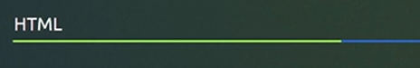

**Introdução ao HTML**

**Hypertext Markup Language**

<!-- 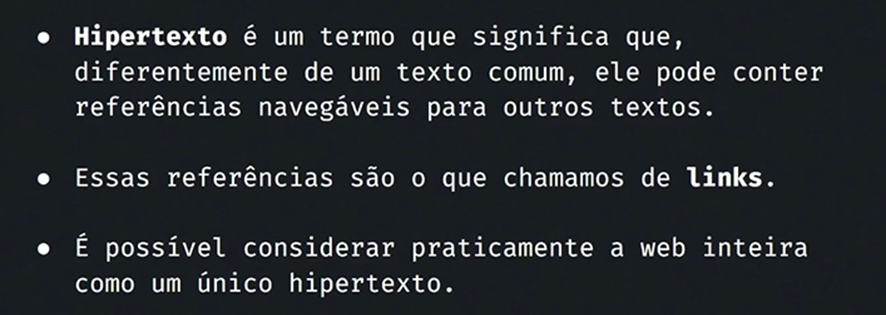 -->

<!--  -->

<!-- 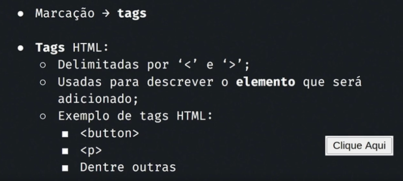 -->

<!-- 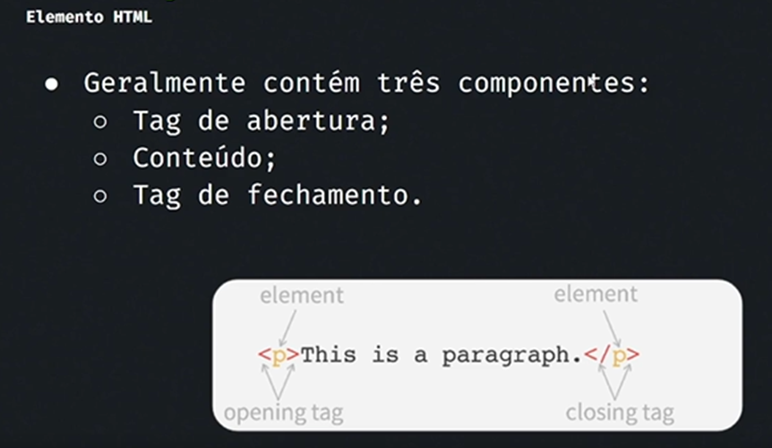 -->

<!-- 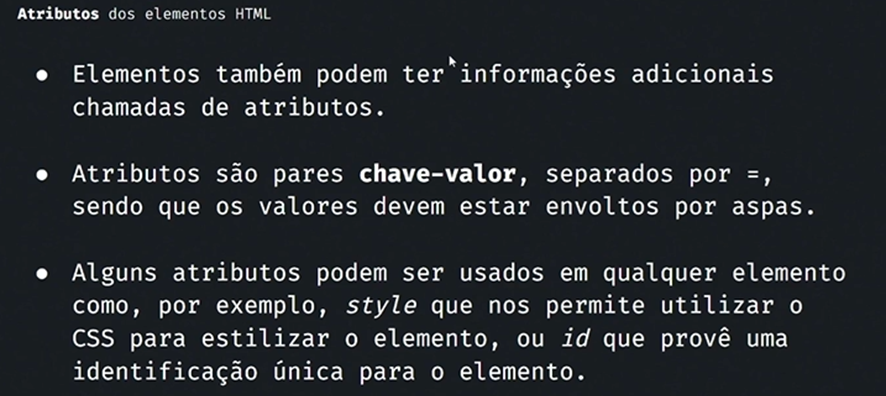 -->

<!-- 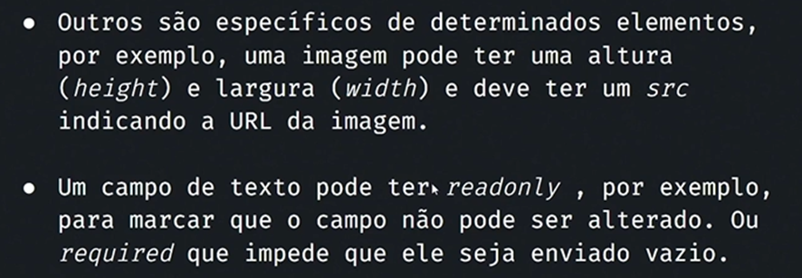 -->

**Estrutura básica do HTML**

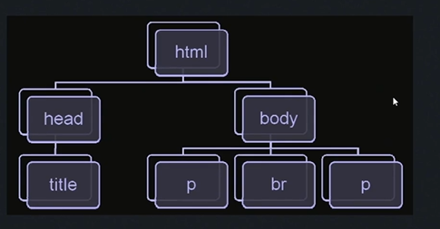

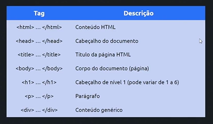

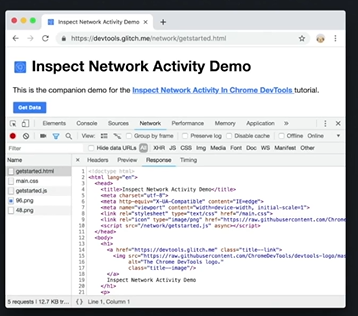

<!-- 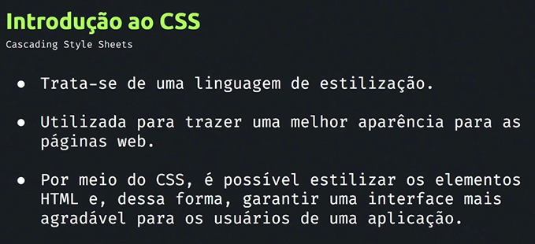 -->

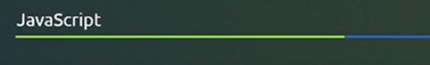

<!-- 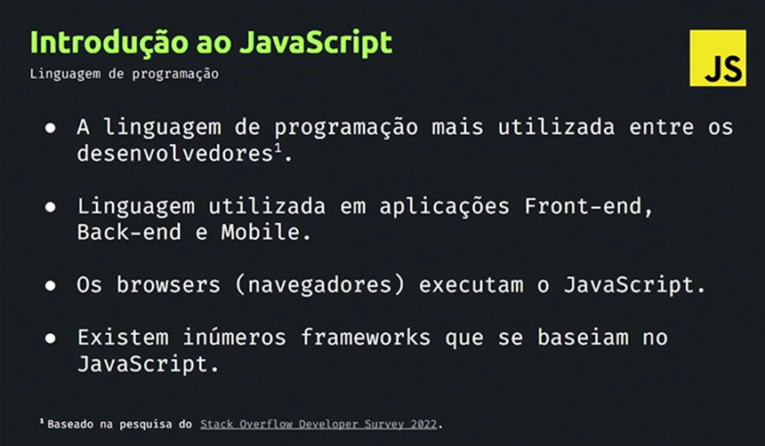 -->

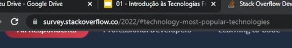

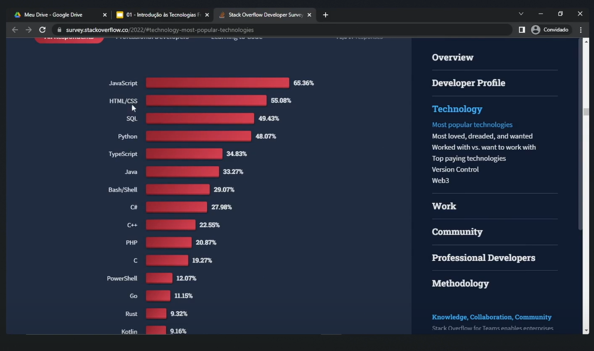

**Resumo**

A figura abaixo descreve como poderíamos representar o HTML, JavaScript
e o CSS.

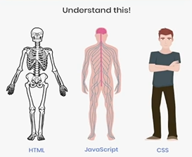

**TypeScript**

Durante as aulas vamos estudar sobre typescript que nada mais é que um
javascript melhorado.

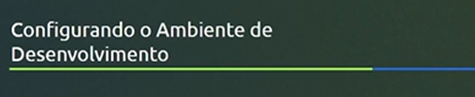

Agora vamos configurar nosso ambiente de desenvolvimento.

Link para realizar o download do VSCode

<https://code.visualstudio.com/download>

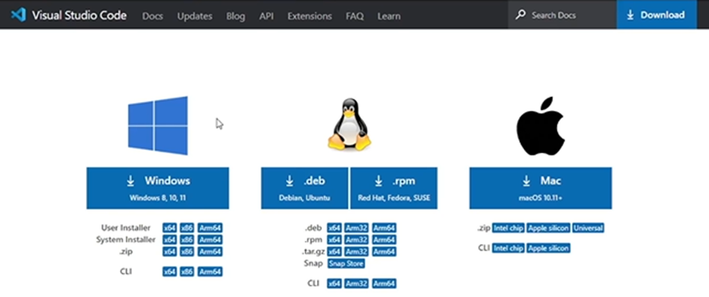

**Tema para usar no VSCode**

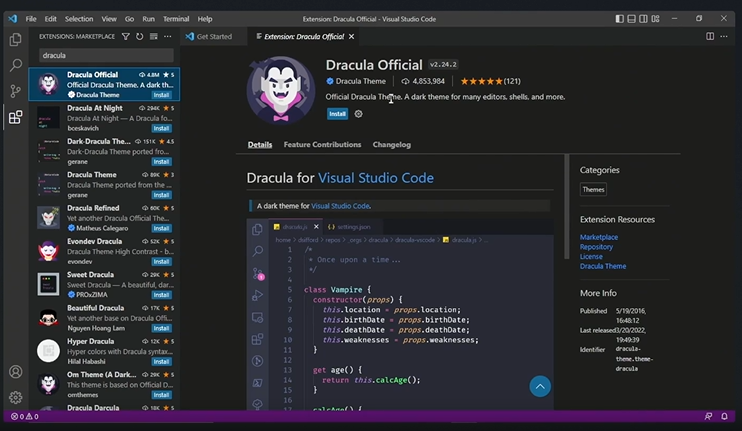

**Material Icon Theme**

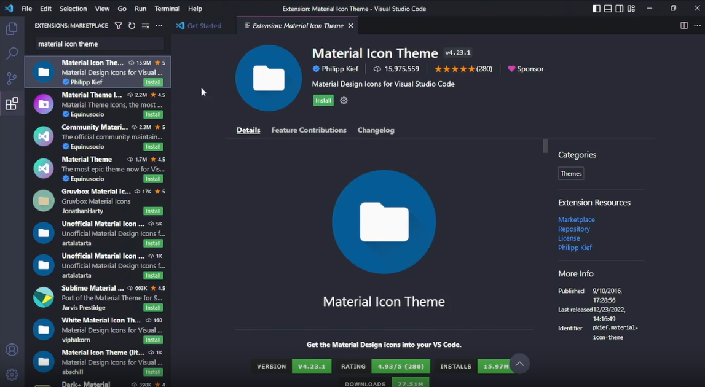

**Destacar comentários com cores diferentes**

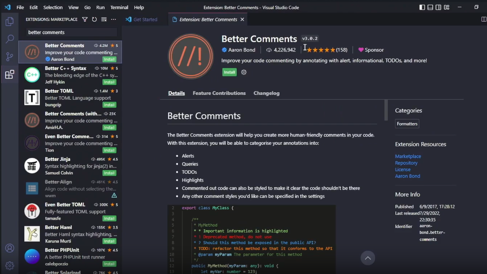

**JavaScript (ES6) code Snippets**

Esta extensão contém trechos de código para JavaScript na sintaxe ES6
para o editor Vs Code (compatível com JavaScript e TypeScript).

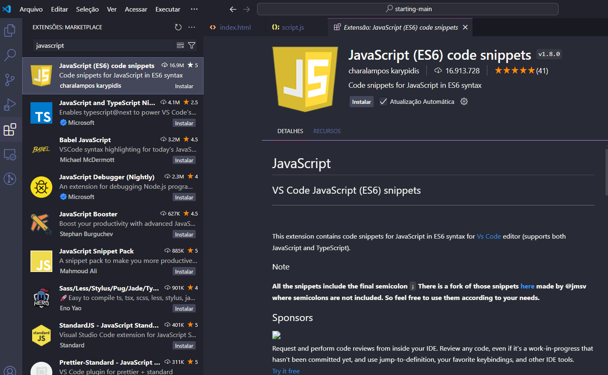

**Node JS**

Vamos instalar o Node clicando no link abaixo.

<http://nodejs.org>

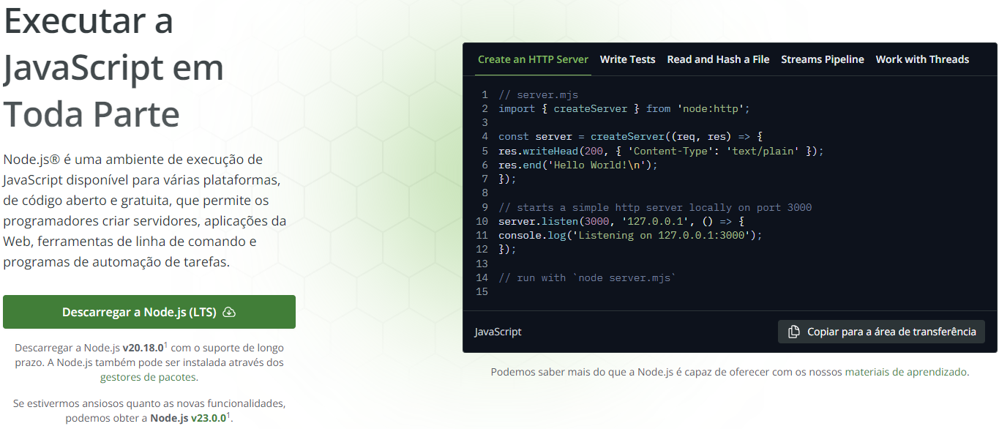

Node.js é uma plataforma de execução de JavaScript em tempo real,
construída sobre o mecanismo V8 de JavaScript do Google Chrome. Ele
permite que você crie aplicativos de rede escaláveis e eficientes usando
JavaScript tanto no lado do servidor quanto no lado do cliente.

**Principais características do Node.js:**

-   **Modelo de E/S não bloqueante:** O Node.js utiliza um modelo de E/S
    assíncrono, o que significa que ele pode lidar com várias
    solicitações simultaneamente sem bloquear o processo principal. Isso
    o torna ideal para aplicativos que precisam lidar com um grande
    número de conexões simultâneas.

-   **Módulos:** O Node.js possui um sistema de módulos que permite
    organizar seu código em arquivos separados e reutilizáveis. Isso
    torna seus projetos mais estruturados e fáceis de manter.

-   **Grande ecossistema de pacotes:** O Node.js possui um vasto
    ecossistema de pacotes disponíveis no npm (Node Package Manager), o
    gerenciador de pacotes oficial do Node.js. Isso significa que você
    pode encontrar pacotes para quase qualquer tarefa que precisar
    realizar, desde a criação de servidores HTTP até o desenvolvimento
    de interfaces gráficas.

-   **Desempenho:** O Node.js é conhecido por seu desempenho, graças ao
    seu modelo de E/S não bloqueante e ao mecanismo V8 de JavaScript.
    Isso o torna uma excelente escolha para aplicativos que exigem alta
    performance.

**Usos comuns do Node.js:**

-   **Criação de servidores web:** O Node.js é amplamente utilizado para
    criar servidores web escaláveis e eficientes. Ele pode ser usado
    para desenvolver APIs RESTful, servidores de chat, servidores de
    jogos e muito mais.

-   **Desenvolvimento de aplicativos em tempo real:** O Node.js é ideal
    para desenvolver aplicativos em tempo real, como chat, jogos online
    e aplicativos de colaboração.

-   **Ferramentas de linha de comando:** O Node.js pode ser usado para
    criar ferramentas de linha de comando úteis para automatizar tarefas
    e aumentar a produtividade.

-   **Internet das Coisas (IoT):** O Node.js é uma plataforma popular
    para desenvolver aplicativos para dispositivos IoT, graças à sua
    capacidade de lidar com dispositivos de baixa potência e de se
    comunicar com diferentes protocolos.

**Vantagens do Node.js:**

-   **Desempenho:** O Node.js é conhecido por seu desempenho, graças ao
    seu modelo de E/S não bloqueante e ao mecanismo V8 de JavaScript.

-   **Escalabilidade:** O Node.js é altamente escalável, o que significa
    que pode lidar com um grande número de conexões simultâneas sem
    perder desempenho.

-   **Ecossistema:** O Node.js possui um vasto ecossistema de pacotes
    disponíveis no npm, o que facilita o desenvolvimento de aplicativos.

-   **Facilidade de uso:** O Node.js é relativamente fácil de aprender
    para desenvolvedores que já conhecem JavaScript.

**Desvantagens do Node.js:**

-   **Modelo de E/S assíncrono:** O modelo de E/S assíncrono do Node.js
    pode ser desafiador para desenvolvedores que não estão acostumados a
    trabalhar com programação assíncrona.

-   **Limitações de CPU:** O Node.js pode ter dificuldades em lidar com
    tarefas intensivas em CPU, como processamento de imagens ou cálculos
    complexos.

**Conclusão:**

O Node.js é uma plataforma poderosa e versátil para o desenvolvimento de
aplicativos de rede. Ele oferece desempenho, escalabilidade, um vasto
ecossistema de pacotes e facilidade de uso. No entanto, é importante
considerar as limitações do Node.js, como o modelo de E/S assíncrono e
as dificuldades em lidar com tarefas intensivas em CPU.

**Linter**

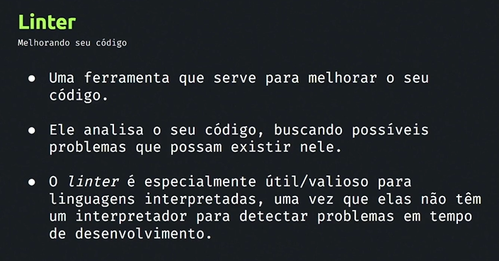

Deixar o seu código mais padronizado, mas agradável, é uma ferramenta
que serve para melhorar o seu código.

Criado pelo desenvolvedor da linguagem c++.

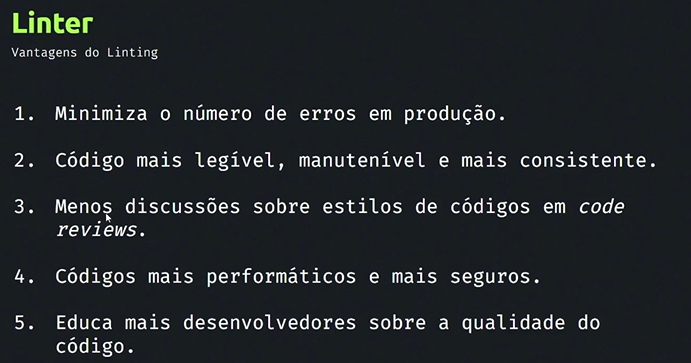

**O que é um Linter?**

Um linter é como um corretor ortográfico para o seu código. É uma
ferramenta de análise estática que examina o seu código-fonte em busca
de possíveis erros, problemas de estilo e inconsistências que podem
levar a bugs ou dificultar a manutenção do seu software.

**Em resumo, um linter:**

-   **Identifica erros:** Encontra erros de sintaxe, tipos de dados
    incompatíveis e outras falhas que podem causar o seu programa a não
    funcionar corretamente.

-   **Garante consistência:** Assegura que o seu código siga um padrão
    de estilo definido, tornando-o mais fácil de ler e entender por você
    e outros desenvolvedores.

-   **Aumenta a segurança:** Alguns linters podem identificar
    vulnerabilidades de segurança no seu código, como possíveis injeções
    de SQL ou cross-site scripting (XSS).

-   **Melhora a performance:** Pode sugerir otimizações para o seu
    código, tornando-o mais rápido e eficiente.

**Por que usar um linter?**

-   **Código mais limpo e organizado:** Um código bem formatado e
    consistente é mais fácil de entender e manter.

-   **Menos bugs:** Ao identificar erros precocemente, você pode
    corrigir problemas antes que eles se tornem mais difíceis de
    resolver.

-   **Melhora a colaboração:** Ao estabelecer um padrão de estilo, os
    linters ajudam a garantir que todos os membros da equipe escrevam
    código de forma consistente.

-   **Aumenta a confiança:** Ao saber que o seu código foi verificado
    por um linter, você pode ter mais confiança na sua qualidade.

**Exemplos de linters:**

-   **JavaScript:** ESLint, JSHint

-   **Python:** Pylint, Flake8

-   **Ruby:** RuboCop

-   **Java:** Checkstyle, PMD

-   **C/C++:** Clang-Tidy

**Como usar um linter:**

1.  **Escolha um linter:** Selecione o linter mais adequado para a sua
    linguagem de programação e as necessidades do seu projeto.

2.  **Configure o linter:** Personalize as regras do linter para que
    elas atendam às suas preferências e às convenções de codificação do
    seu projeto.

3.  **Integre o linter à sua ferramenta de desenvolvimento:** Configure
    sua IDE ou sistema de build para executar o linter automaticamente
    quando você salvar um arquivo.

4.  **Resolva os problemas identificados:** Analise os resultados do
    linter e corrija os problemas identificados no seu código.

**Comclusão**

Um linter é uma ferramenta essencial para qualquer desenvolvedor que se
preocupa com a qualidade do seu código. Ao usar um linter, você pode
escrever código mais limpo, mais seguro e mais fácil de manter.

**ESLint**

Linter para o JavaScript

Acesse o link abaixo para entender mais sobre ele

<https://eslint.org/>

No VSCode no campo pesquisa de extensões pesquise eslint para instalar.

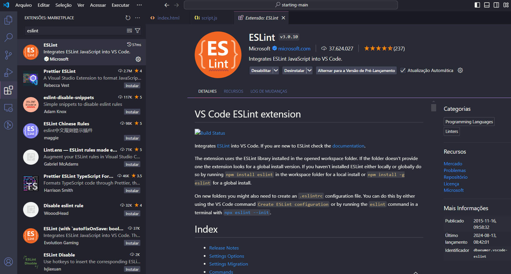

**Formatador de código**

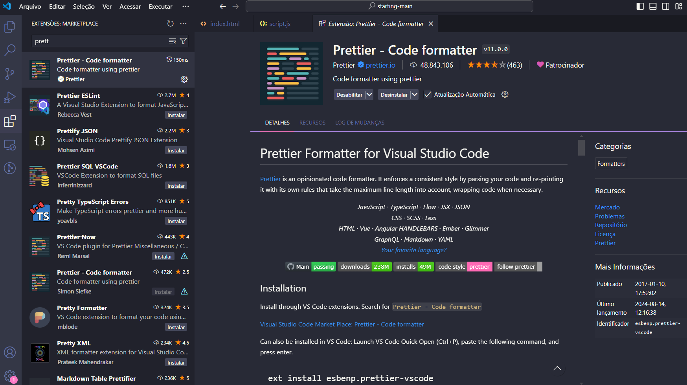

**NPM**

<https://www.npmjs.com/>

Gerenciador de pacotes do Node.js. É utilizado para ajudar a instalar
pacotes.

**O que é npm?**

**Npm** (Node Package Manager) é uma ferramenta essencial para
desenvolvedores JavaScript que utilizam o Node.js. Ele serve como um
repositório gigantesco de pacotes e bibliotecas de código aberto, além
de oferecer um mecanismo eficiente para gerenciar as dependências dos
seus projetos.

**Em resumo, o npm permite:**

-   **Instalar pacotes:** Você pode encontrar e instalar facilmente
    milhares de pacotes de código prontos para uso, como frameworks,
    bibliotecas de utilitários, ferramentas de desenvolvimento e muito
    mais.

-   **Gerenciar dependências:** O npm mantém um registro preciso das
    dependências do seu projeto em um arquivo package.json. Isso
    facilita a instalação das mesmas dependências em outros ambientes ou
    por outros desenvolvedores.

-   **Publicar pacotes:** Você também pode compartilhar seus próprios
    pacotes com a comunidade, tornando seu código disponível para outros
    desenvolvedores.

**Como o npm funciona?**

1.  **Criação do arquivo package.json:** Ao iniciar um novo projeto
    Node.js, o npm cria um arquivo package.json. Este arquivo contém
    informações sobre o seu projeto, como nome, versão, descrição e,
    mais importante, uma lista das dependências necessárias.

2.  **Instalação de pacotes:** Para instalar um pacote, você utiliza o
    comando npm install \<nome-do-pacote\>. O npm baixa o pacote e suas
    dependências, adicionando-as ao seu projeto e atualizando o arquivo
    package.json.

3.  **Gerenciamento de versões:** O npm permite especificar versões
    exatas ou intervalos de versões para as dependências, garantindo que
    seu projeto funcione corretamente com as versões corretas dos
    pacotes.

**Por que usar o npm?**

-   **Acelera o desenvolvimento:** Ao reutilizar pacotes existentes,
    você pode economizar tempo e esforço no desenvolvimento de suas
    aplicações.

-   **Melhora a colaboração:** O npm facilita a colaboração em projetos,
    pois permite que diferentes desenvolvedores utilizem as mesmas
    dependências.

-   **Gerencia dependências de forma eficiente:** O npm mantém um
    registro preciso das dependências do seu projeto, evitando conflitos
    de versões e facilitando a atualização das dependências.

-   **Grande comunidade:** O npm possui uma vasta comunidade de
    desenvolvedores que contribuem com novos pacotes e atualizam os
    existentes.

**Exemplo:**

Bash

\# Criar um novo projeto Node.js

npm init -y

\# Instalar o framework Express

npm install express

Use o código [com cuidado](/faq#coding).

**Em resumo:**

O npm é uma ferramenta indispensável para qualquer desenvolvedor
Node.js. Ele simplifica o gerenciamento de dependências, permite a
reutilização de código e facilita a colaboração em projetos. Se você
está trabalhando com Node.js, o npm é uma ferramenta que você precisa
conhecer.

**Json**

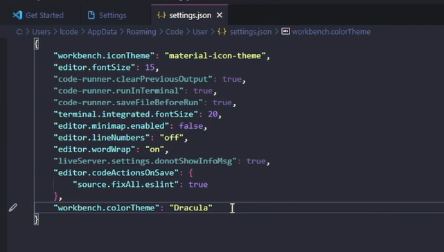

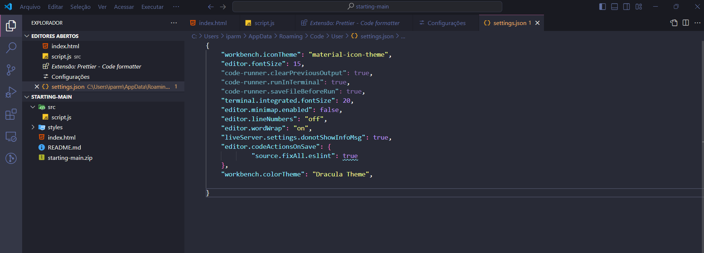

{

    \"workbench.iconTheme\": \"material-icon-theme\",

    \"editor.fontSize\": 16,

    \"code-runner.clearPreviousOutput\": true,

    \"code-runner.runInTerminal\": true,

    \"code-runner.saveFileBeforeRun\": true,

    \"terminal.integrated.fontSize\": 20,

    \"editor.minimap.enabled\": false,

    \"editor.lineNumbers\": \"on\",

    \"liveServer.settings.donotShowInfoMsg\": true,

    \"editor.source.fixAll.eslint\": true,

    \"workbench.colorTheme\": \"Dracula Theme Soft\",

    \"editor.wordWrap\": \"off\"

}

  

# **Exercício 1**

## **Questão 1**

Sobre o HTML, assinale a alternativa correta:

a)  Hipertexto é um texto que possui um tamanho de fonte maior e que se
    apresenta em negrito.

b)  HTML é uma linguagem de programação.

c)  A versão mais recente do HTML é o HTML5. Essa versão trouxe várias
    melhorias em relação às versões anteriores, incluindo suporte a
    recursos multimídia embutidos, novas tags semânticas, APIs de
    interação avançadas e melhorias no desempenho e acessibilidade.

d)  No HTML, cada atributo é definido dentro da tag de fechamento,
    utilizando o formato chave-valor.

**Alternativa C**

 

## **Questão 2**

Marque a afirmativa correta sobre a ferramenta do Linter:

a)  É uma ferramenta que cria um código mais legível e mais consistente.
    Porém, possui uma limitação, ela gera mais discussões sobre estilos
    de códigos em code reviews.

b)  O Linter é usado principalmente para introduzir erros no código de
    produção, a fim de testar a resiliência do sistema e auxiliar na
    criação de um código mais seguro.

c)  O Linter é uma ferramenta de design gráfico usada para criar
    interfaces de usuário mais atraentes.

d)  O Linter é uma ferramenta que tem como objetivo identificar e
    relatar problemas no código-fonte de um projeto. Ele auxilia na
    criação de um código mais legível, manutenível e mais consistente.

**Alternativa D**