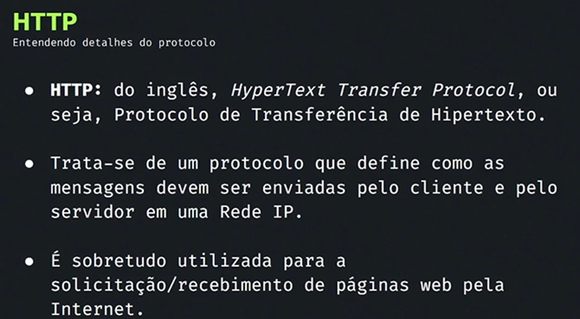

# **2. ARQUITETURA CLIENTE-SERVIDOR PARA WEB**

## **Aula 02: Como a Web Funciona?**

**Arquitetura Cliente-Servidor**

 

**O que é a Arquitetura Cliente-Servidor?**

A arquitetura cliente-servidor é um modelo de interação em redes de
computadores onde um dispositivo, o **cliente**, solicita um serviço a
outro dispositivo, o **servidor**. No contexto da Web, o cliente é
tipicamente um navegador (como Chrome, Firefox ou Edge) e o servidor é
um computador que hospeda um site.

**Como Funciona na Web?**

1.  **O Usuário Faz uma Solicitação:** Quando você digita um endereço
    web (URL) no seu navegador e pressiona Enter, o navegador envia uma
    solicitação ao servidor onde o site está hospedado.

2.  **O Servidor Processa a Solicitação:** O servidor recebe a
    solicitação, localiza o arquivo solicitado (por exemplo, uma página
    HTML) e o envia de volta ao navegador.

3.  **O Navegador Exibe o Conteúdo:** O navegador recebe o arquivo e o
    interpreta, exibindo o conteúdo na tela do seu dispositivo.

**Componentes Principais:**

-   **Cliente:**

    -   **Navegador:** Interface do usuário que permite a interação com
        a web.

    -   **Dispositivo:** Computador, smartphone, tablet, etc.

-   **Servidor:**

    -   **Hardware:** Computador poderoso com grande capacidade de
        armazenamento.

    -   **Software:** Sistema operacional (Linux, Windows Server),
        servidor web (Apache, Nginx), banco de dados (MySQL,
        PostgreSQL), linguagem de programação (PHP, Python, JavaScript).

**Vantagens da Arquitetura Cliente-Servidor:**

-   **Escalabilidade:** Facilidade em adicionar mais servidores para
    atender a um aumento no número de usuários.

-   **Manutenção:** Permite atualizar o servidor sem afetar os clientes.

-   **Compartilhamento de recursos:** Múltiplos clientes podem acessar
    os mesmos dados e serviços.

-   **Segurança:** Centralização da segurança no servidor.

**Exemplos de Aplicações:**

-   **Sites:** Qualquer site que você visita, desde blogs pessoais até
    grandes plataformas de comércio eletrônico.

-   **Aplicativos Web:** Gmail, Facebook, Netflix, etc.

-   **Serviços de Streaming:** Spotify, YouTube.

-   **Banco de Dados:** Acesso a bancos de dados remotos.

**Diagrama Simplificado:**

<https://developer.mozilla.org/en-US/docs/Learn/Server-side/First_steps/Client-Server_overview>

clientserver architecture diagram for web applications, showing the
client (browser) making a request to the server and the server sending a
response

**Camadas da Arquitetura:**

-   **Camada de Apresentação:** Interface do usuário (HTML, CSS,
    JavaScript).

-   **Camada de Lógica de Negócios:** Processamento das solicitações do
    cliente (linguagem de programação).

-   **Camada de Dados:** Armazenamento e recuperação de dados (banco de
    dados).

**Protocolos Importantes:**

-   **HTTP:** Protocolo de transferência de hipertexto, responsável pela
    comunicação entre o cliente e o servidor.

-   **HTTPS:** Versão segura do HTTP, que utiliza criptografia para
    proteger a comunicação.

**Conceitos Relacionados:**

-   **Web Services:** Serviços que expõem funcionalidades através da
    web, permitindo a integração entre diferentes sistemas.

-   **APIs:** Interfaces de programação de aplicativos que permitem a
    interação com diferentes sistemas.

-   **Cloud Computing:** Utilização de recursos computacionais na nuvem
    para hospedar aplicações web.

**Em Resumo**

A arquitetura cliente-servidor é fundamental para a web moderna,
permitindo que bilhões de pessoas acessem informações e serviços em
qualquer lugar do mundo. Ao entender os componentes e como eles
interagem, você terá uma base sólida para compreender como a web
funciona e como desenvolver aplicações web.

**Gostaria de saber mais sobre algum aspecto específico da arquitetura
cliente-servidor?** Por exemplo, posso explicar mais sobre:

-   **Protocolos HTTP e HTTPS**

-   **Linguagens de programação para desenvolvimento web**

-   **Bancos de dados e sua relação com a web**

-   **Cloud computing e suas implicações na arquitetura
    cliente-servidor**

-   **Segurança em aplicações web**

**Protocolo HTTP**

<!--  -->

<!--  -->

<!--  -->

<!--  -->

<!--  -->

**Protocolos HTTP e HTTPS**

**HTTP (HyperText Transfer Protocol)** e **HTTPS (HyperText Transfer
Protocol Secure)** são os dois principais protocolos usados para a
comunicação entre navegadores e servidores web. Ambos seguem o modelo
cliente-servidor, mas existem diferenças importantes entre eles,
principalmente no que diz respeito à segurança. Vamos explorar cada um
deles:

**HTTP (HyperText Transfer Protocol)**

-   **Objetivo**: Protocolo de comunicação responsável pela
    transferência de dados na web.

-   **Funcionamento**: Envia solicitações de cliente (navegador ou API)
    ao servidor, que responde com os dados (página web, arquivos, etc.).

-   **Porta padrão**: 80.

-   **Segurança**: Não criptografa os dados trocados entre cliente e
    servidor. As informações, incluindo senhas e outros dados sensíveis,
    podem ser interceptadas por terceiros (ataques man-in-the-middle).

-   **Uso típico**: Sites que não lidam com informações confidenciais ou
    sensíveis, ou em redes seguras.

**HTTPS (HyperText Transfer Protocol Secure)**

-   **Objetivo**: Protocolo semelhante ao HTTP, porém com um foco maior
    em segurança. HTTPS usa criptografia para proteger a comunicação
    entre cliente e servidor.

-   **Funcionamento**: Utiliza SSL/TLS (Secure Sockets Layer / Transport
    Layer Security) para criptografar os dados. Isso garante que as
    informações trocadas (como logins, números de cartão de crédito,
    etc.) estejam protegidas e não possam ser facilmente interceptadas.

-   **Porta padrão**: 443.

-   **Segurança**: HTTPS garante três níveis de segurança:

    1.  **Criptografia**: Os dados transmitidos são codificados e só
        podem ser lidos pelo destinatário correto.

    2.  **Integridade dos dados**: Garante que os dados não sejam
        alterados ou corrompidos durante a transferência.

    3.  **Autenticação**: O certificado SSL/TLS garante que o cliente
        está se comunicando com o servidor correto, evitando ataques de
        spoofing.

-   **Uso típico**: Sites que tratam informações sensíveis (bancos,
    e-commerce, redes sociais, etc.). Desde 2018, o uso de HTTPS tem
    sido cada vez mais incentivado em todos os sites, com navegadores
    mostrando alertas de segurança em sites que usam apenas HTTP.

**Principais Diferenças entre HTTP e HTTPS:**

1.  **Segurança**:

    -   HTTP: Não oferece nenhuma segurança.

    -   HTTPS: Usa criptografia SSL/TLS para proteger os dados.

2.  **Velocidade**:

    -   HTTP: Pode ser ligeiramente mais rápido, pois não tem o overhead
        da criptografia.

    -   HTTPS: Um pouco mais lento devido ao processo de
        criptografia/descriptografia, mas o impacto geralmente é mínimo.

3.  **Confiança e SEO**:

    -   HTTPS é um fator de classificação (ranking) nos mecanismos de
        busca como o Google, e os usuários tendem a confiar mais em
        sites com HTTPS.

Em resumo, **HTTPS** é uma versão segura do **HTTP** e deve ser sempre
preferido, especialmente para sites que envolvem dados pessoais e
confidenciais.

<!--  -->

**Métodos HTTP**

<!--  -->

Os métodos HTTP (HyperText Transfer Protocol) são as diferentes formas
que os navegadores e outros clientes podem interagir com servidores para
realizar operações específicas. Abaixo estão os métodos HTTP mais
comuns:

<!--  -->

1.  **GET**:

    -   **Objetivo**: Recuperar dados de um servidor.

    -   **Uso comum**: Obter páginas da web, buscar dados de uma API.

    -   **Segurança**: Os dados são passados pela URL.

    -   **Idempotente**: Sim (repetir a requisição não altera o estado
        no servidor).

2.  **POST**:

    -   **Objetivo**: Enviar dados ao servidor para processamento,
        normalmente para criar ou modificar um recurso.

    -   **Uso comum**: Enviar formulários, adicionar novos registros em
        uma API.

    -   **Idempotente**: Não (a mesma requisição pode gerar diferentes
        efeitos).

3.  **PUT**:

    -   **Objetivo**: Atualizar um recurso existente ou criar um recurso
        se ele não existir.

    -   **Uso comum**: Atualizar registros completos.

    -   **Idempotente**: Sim.

4.  **DELETE**:

    -   **Objetivo**: Deletar um recurso no servidor.

    -   **Uso comum**: Excluir registros de uma API.

    -   **Idempotente**: Sim.

5.  **PATCH**:

    -   **Objetivo**: Atualizar parcialmente um recurso.

    -   **Uso comum**: Atualizações parciais de registros (diferente de
        PUT, que atualiza o registro inteiro).

    -   **Idempotente**: Sim.

6.  **HEAD**:

    -   **Objetivo**: Recuperar os cabeçalhos de resposta, sem o corpo
        da resposta.

    -   **Uso comum**: Verificar se um recurso existe ou o estado de um
        recurso sem transferir dados.

    -   **Idempotente**: Sim.

7.  **OPTIONS**:

    -   **Objetivo**: Consultar o servidor sobre os métodos suportados
        para um recurso específico.

    -   **Uso comum**: Verificar quais métodos HTTP podem ser usados em
        uma API.

    -   **Idempotente**: Sim.

Esses métodos permitem a criação, leitura, atualização e exclusão de
recursos na web (operações CRUD).

<!--  -->

Médos poucos comuns.

**Mensagens HTTP**

**A Linguagem da Web**

As mensagens HTTP são a base da comunicação entre um cliente
(normalmente um navegador) e um servidor na internet. Elas são como
conversas entre duas pessoas, mas nesse caso, a conversa é sobre
arquivos, páginas web e dados.

**Estrutura de uma Mensagem HTTP:**

Uma mensagem HTTP é composta por duas partes principais:

1.  **Linha de pedido (request line):** Indica o método HTTP (GET, POST,
    PUT, DELETE, etc.), o recurso solicitado (URL) e a versão do
    protocolo HTTP.

2.  **Cabeçalhos:** Contêm informações adicionais sobre a requisição ou
    resposta, como o tipo de conteúdo, a data, o código de status, etc.

3.  **Corpo:** Contém os dados da requisição (por exemplo, dados de um
    formulário) ou da resposta (por exemplo, o conteúdo de uma página
    HTML).

**Exemplo de uma requisição HTTP:**

GET /index.html HTTP/1.1

Host: www.exemplo.com

User-Agent: Mozilla/5.0 (Windows NT 10.0; Win64; x64) AppleWebKit/537.36
(KHTML, like Gecko) Chrome/58.0.3029.110 Safari/537.36  

**Exemplo de uma resposta HTTP:**

HTTP/1.1 200 OK

Content-Type: text/html

Date: Mon, 27 Jul 2017 05:51:36 GMT

      <!DOCTYPE html>

      <html>

         <head>

            <title>Exemplo de página</title>

         </head>

         <body>

            
Olá, mundo!

         </body>

      </html>

**Tipos de Mensagens HTTP:**

-   **Requisições:** Enviadas pelo cliente para o servidor.

    -   **GET:** Obter um recurso.

    -   **POST:** Enviar dados para serem processados no servidor (por
        exemplo, dados de um formulário).

    -   **PUT:** Enviar dados para atualizar um recurso existente.

    -   **DELETE:** Deletar um recurso.

    -   **E muitos outros\...**

-   **Respostas:** Enviadas pelo servidor para o cliente.

    -   **200 OK:** A requisição foi bem-sucedida.

    -   **404 Not Found:** O recurso solicitado não foi encontrado.

    -   **500 Internal Server Error:** Ocorreu um erro no servidor.

    -   **E muitos outros códigos de status\...**

**A importância das mensagens HTTP:**

-   **Comunicação entre cliente e servidor:** Permitem que navegadores e
    servidores se entendam.

-   **Transferência de dados:** São usadas para enviar e receber
    arquivos, imagens, vídeos e outros tipos de dados.

-   **Web Services:** Formam a base dos web services, que permitem a
    interação entre diferentes sistemas.

-   **APIs:** São utilizadas para criar interfaces de programação de
    aplicativos (APIs).

**Para saber mais:**

-   **MDN Web Docs:**

> <https://developer.mozilla.org/pt-BR/docs/Web/HTTP/Messages>

-   **DevMedia:** <https://www.devmedia.com.br/http-codes/669>

**Mensagens HTTP**

As **mensagens HTTP** são a base da comunicação entre clientes
(navegadores ou outros agentes) e servidores na web. Elas podem ser
divididas em **mensagens de requisição** (enviadas pelo cliente para o
servidor) e **mensagens de resposta** (enviadas pelo servidor em
resposta ao cliente). Vamos explorar as duas.

**1. Mensagens de Requisição HTTP**

As requisições HTTP são enviadas do cliente para o servidor com o
objetivo de realizar alguma ação, como solicitar um recurso (página web,
arquivo, etc.), enviar dados, atualizar ou excluir informações. Uma
mensagem de requisição consiste em:

**Estrutura de uma requisição HTTP:**

-   **Linha de requisição**: Contém o método HTTP, o caminho (URL) e a
    versão do protocolo HTTP.

    -   Exemplo: GET /index.html HTTP/1.1

-   **Cabeçalhos de requisição**: Fornecem informações adicionais sobre
    a requisição, como o tipo de navegador, formato de aceitação, tipo
    de conteúdo, entre outros.

    -   Exemplo:

> 
>
> Host: www.exemplo.com
>
> User-Agent: Mozilla/5.0
>
> Accept: text/html

-   **Corpo da requisição**: Contém os dados enviados ao servidor.
    Apenas alguns métodos HTTP, como POST e PUT, possuem corpo de
    requisição. Por exemplo, ao enviar um formulário de login, os dados
    do formulário são incluídos no corpo.

**Exemplo de Requisição HTTP (usando o método POST):**

POST /login HTTP/1.1

Host: www.exemplo.com

Content-Type: application/x-www-form-urlencoded

Content-Length: 27

username=joao&password=12345

**2. Mensagens de Resposta HTTP**

As respostas HTTP são enviadas do servidor para o cliente como resultado
de uma requisição. Elas contêm informações sobre o status da requisição
e os dados solicitados, quando aplicável.

**Estrutura de uma resposta HTTP:**

-   **Linha de status**: Inclui a versão do protocolo HTTP, um código de
    status e uma mensagem de status descritiva.

    -   Exemplo: HTTP/1.1 200 OK

-   **Cabeçalhos de resposta**: Proporcionam metadados sobre a resposta,
    como o tipo de conteúdo retornado, tamanho, codificação, entre
    outros.

    -   Exemplo:

> Content-Type: text/html
>
> Content-Length: 3456

-   **Corpo da resposta**: Contém os dados retornados pelo servidor,
    como a página HTML, JSON, imagem, etc. Nem todas as respostas
    possuem corpo.

**Exemplo de Resposta HTTP (para uma requisição bem-sucedida):**

HTTP/1.1 200 OK

Date: Mon, 15 Sep 2024 10:15:30 GMT

Content-Type: text/html

Content-Length: 3456

      <html>

         <head>
            <title>Exemplo</title>
         </head>

         <body>
            <h1>Bem-vindo ao site de exemplo!</h1>
         </body>

      </html>

**Principais Métodos HTTP**

-   **GET**: Solicita a recuperação de um recurso. Não possui corpo de
    requisição.

-   **POST**: Envia dados ao servidor, geralmente usados em formulários.

-   **PUT**: Atualiza ou substitui um recurso existente no servidor.

-   **DELETE**: Remove um recurso do servidor.

-   **HEAD**: Igual ao GET, mas sem corpo de resposta (apenas
    cabeçalhos).

-   **OPTIONS**: Descreve as opções de comunicação para o recurso.

-   **PATCH**: Faz uma modificação parcial em um recurso existente.

**Códigos de Status HTTP**

Os códigos de status indicam o resultado da requisição. Os mais comuns
são:

-   **1xx**: Informativo (Exemplo: 101 Switching Protocols)

-   **2xx**: Sucesso (Exemplo: 200 OK, 201 Created)

-   **3xx**: Redirecionamento (Exemplo: 301 Moved Permanently, 302
    Found)

-   **4xx**: Erro do cliente (Exemplo: 400 Bad Request, 404 Not Found)

-   **5xx**: Erro do servidor (Exemplo: 500 Internal Server Error)

Esses componentes juntos formam as mensagens HTTP que permitem a
comunicação entre cliente e servidor na web.

<!---->

<!---->

Acesse:

<https://developer.mozilla.org/pt-BR/docs/Web/HTTP>

Site que possue muita documentação a respeito da WEB.

<!--  -->

**Códigos de Status**

**HTTP: A Linguagem dos Servidores**

Os **códigos de status HTTP** são como sinais de trânsito na web. Eles
indicam o resultado de uma requisição feita por um cliente (seu
navegador, por exemplo) a um servidor. Cada código possui um significado
específico, informando se a solicitação foi bem-sucedida, se houve algum
erro ou se é necessário realizar alguma ação adicional.

**Classificação dos Códigos:**

Os códigos de status são divididos em cinco classes principais:

-   **1xx (Informativo):** A requisição foi recebida e está sendo
    processada.

-   **2xx (Sucesso):** A requisição foi recebida, compreendida e aceita
    pelo servidor.

-   **3xx (Redirecionamento):** É necessário realizar uma ação adicional
    para completar a requisição.

-   **4xx (Erro do Cliente):** Ocorreu um erro do lado do cliente (por
    exemplo, página não encontrada).

-   **5xx (Erro do Servidor):** Ocorreu um erro no servidor.

**Códigos Comuns e Seus Significados:**

-   **200 OK:** A requisição foi bem-sucedida. É o código mais comum
    para uma página carregada corretamente.

-   **404 Not Found:** A página solicitada não foi encontrada no
    servidor.

-   **500 Internal Server Error:** Ocorreu um erro interno no servidor.

-   **301 Moved Permanently:** O recurso solicitado foi movido
    permanentemente para um novo URL.

-   **302 Found:** O recurso solicitado foi encontrado temporariamente
    em outro URL.

-   **401 Unauthorized:** É necessário autenticar-se para acessar o
    recurso.

-   **403 Forbidden:** Você não tem permissão para acessar o recurso.

**Tabela Resumida:**

**Por que os códigos de status são importantes?**

-   **Detecção de problemas:** Ajudam a identificar erros na aplicação
    ou no servidor.

-   **Otimização de sites:** Podem ser usados para identificar links
    quebrados, redirecionamentos incorretos e outros problemas que
    afetam a experiência do usuário.

-   **Desenvolvimento de APIs:** São essenciais para a construção de
    APIs robustas e confiáveis.

-   **SEO:** Alguns códigos de status podem influenciar o ranking de um
    site nos resultados de busca.

**Exemplo Prático:**

Ao acessar um site e receber a mensagem \"404 Not Found\", significa que
a página que você está procurando não existe no servidor.

<!--  -->

<!--  -->

<!--  -->

<!--  -->

  

# **Exercício 2**

 

## **Questão 1**

Sobre o protocolo HTTP, verifique quais afirmativas abaixo são
verdadeiras (V) e quais são falsas (F). Em seguida, assinale a
alternativa correta.

1.  HTTP é um protocolo que define como as mensagens devem ser enviadas
    pelo cliente e pelo servidor em uma Rede IP.

2.  O HTTP utiliza o protocolo TCP/IP para o transporte das informações
    entre cliente e servidor. De modo que, o IP é o "CPF" de um
    dispositivo dentro da Internet, e o TCP estabelece a conexão entre
    cliente e servidor e organiza os dados que serão transmitidos entre
    eles.

3.  Para obter o endereço IP de um servidor, é necessário consultar o
    servidor HTTPS.

4.  O HTTP é um protocolo que define como deve ser feita a solicitação e
    o recebimento de páginas web.

a)  F V F V

b)  V V F V

c)  V V V V

d)  V V F F

**A alternativa correta é a letra B) V V F V.**

Vamos analisar cada afirmativa:

1.  **HTTP é um protocolo que define como as mensagens devem ser
    enviadas pelo cliente e pelo servidor em uma Rede IP.** (V)

    -   **Verdadeiro:** O HTTP (HyperText Transfer Protocol) é o
        protocolo fundamental para a comunicação na World Wide Wide Web.
        Ele define as regras e formatos das mensagens trocadas entre
        clientes (navegadores) e servidores web.

2.  **O HTTP utiliza o protocolo TCP/IP para o transporte das
    informações entre cliente e servidor. De modo que, o IP é o "CPF" de
    um dispositivo dentro da Internet, e o TCP estabelece a conexão
    entre cliente e servidor e organiza os dados que serão transmitidos
    entre eles.** (V)

    -   **Verdadeiro:** O HTTP opera sobre o TCP/IP. O IP (Internet
        Protocol) é responsável por endereçar os dispositivos na rede,
        enquanto o TCP (Transmission Control Protocol) garante a entrega
        confiável dos dados, dividindo-os em pacotes e reordenando-os na
        ordem correta no destino.

3.  **Para obter o endereço IP de um servidor, é necessário consultar o
    servidor HTTPS.** (F)

    -   **Falso:** Para obter o endereço IP de um servidor, você pode
        usar ferramentas como o comando ping no terminal, ou consultar
        um serviço de DNS (Domain Name System), que associa nomes de
        domínio a endereços IP. O HTTPS é uma versão segura do HTTP, que
        utiliza criptografia para proteger a comunicação, mas não é
        utilizado para obter endereços IP.

4.  **O HTTP é um protocolo que define como deve ser feita a solicitação
    e o recebimento de páginas web.** (V)

    -   **Verdadeiro:** O principal objetivo do HTTP é permitir a
        solicitação e o recebimento de páginas web. Ele define os
        métodos de requisição (GET, POST, PUT, DELETE, etc.), os códigos
        de status das respostas (200 OK, 404 Not Found, etc.) e os
        cabeçalhos que acompanham as requisições e respostas.

**Em resumo:**

-   O HTTP é a base da comunicação na web.

-   Ele utiliza o TCP/IP para o transporte de dados.

-   Para obter um endereço IP, não é necessário consultar um servidor
    HTTPS.

-   O HTTP é fundamental para a solicitação e o recebimento de páginas
    web.

 

## **Questão 2**

Sobre os métodos HTTP, assinale a alternativa correta:

a)  O protocolo HTTP possui apenas 2 métodos: GET, utilizado para obter
    um recurso do servidor; e POST, utilizado para enviar dados para o
    servidor.

b)  O método GET é utilizado para enviar dados para o servidor e o
    método DELETE é utilizado para deletar um dado do servidor.

c)  É possível enviar dados para o servidor, mas não é possível
    modificar um dado do servidor.

d)  Os métodos GET e POST são utilizados para obter um recurso do
    servidor e para enviar dados para o servidor, respectivamente.

A alternativa correta sobre os métodos HTTP é:

**\"Os métodos GET e POST são utilizados para obter um recurso do
servidor e para enviar dados para o servidor, respectivamente.\"**

**Alternativa correta é a D.**

Explicações sobre as demais alternativas:

-   **\"O protocolo HTTP possui apenas 2 métodos: GET, utilizado para
    obter um recurso do servidor; e POST, utilizado para enviar dados
    para o servidor.\"**\
    Incorreto. O HTTP possui outros métodos além de GET e POST, como
    PUT, DELETE, PATCH, HEAD, OPTIONS, entre outros.

-   **\"O método GET é utilizado para enviar dados para o servidor e o
    método DELETE é utilizado para deletar um dado do servidor.\"**\
    Incorreto. O método GET é utilizado para **obter** dados do
    servidor, não para enviá-los. O método DELETE, de fato, é utilizado
    para deletar um recurso no servidor.

-   **\"É possível enviar dados para o servidor, mas não é possível
    modificar um dado do servidor.\"**\
    Incorreto. Métodos como POST, PUT e PATCH permitem modificar ou
    criar dados no servidor.