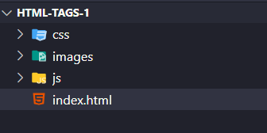
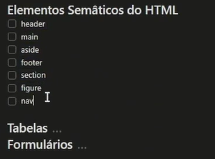
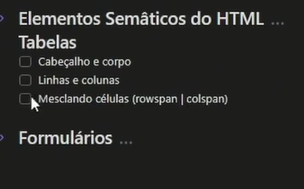

# 3. **HTML BÁSICO**




```
<!DOCTYPE html>
<html lang="pt-br">

   <head>
      <meta charset="UTF-8">
      <meta http-equiv="X-UA-Compatible" content="ie=edge">
      <meta name="description" content="">
      <meta name="viewport" content="width=device-width, initial-scale=1.0">
      <title>HTML Básico | Front-end em React</title>
   </head>

   <body>
      <!-- ctrl + ; para criar as tags de comentário no html -->
      <!-- Principais Tags HTML -->
      <h1>Cabeçalho 1</h1>
      <h2>Cabeçalho 2</h2>
      <h3>Cabeçalho 3</h3>
      <h4>Cabeçalho 4</h4>
      <h5>Cabeçalho 5</h5>
      <h6>Cabeçalho 6</h6>
      <p>Isso aqui é um paragrafo</p>
      <br>
      <p> Isso aqui é um paragrafo </p>
      <br>
      <a href="http://www.google.com.br" target="_blank" rel="Google"> Clique aqui </a>
      <br>
      <br>
      
      <!-- Listas não numerada -->
      <ul>
         <li>Primeiro item</li>
         <li>Segundo item</li>
         <li>Terceiro item</li>
      </ul>
      <!-- Listas numeradas -->
      <ol>
         <li>Primeiro item</li>
         <li>Segundo item</li>
         <li>Terceiro item</li>
      </ol>
      <br>
      <!-- Tags de uso genérico -->
      <div>Isso aqui é uma div.</div> <!-- div é block - ocupa toda linha em que ela foi criada -->
      <span>Isso aqui é uma span.</span> <!-- span é inline - ocupa apenas o espaço que tem um texto dentro dele -->
      <p> Eu vou colocar um texto <div>Isso aqui é uma div </div> qualquer aqui dentro.</p>
      <br>
      <p>Eu vou colocar um texto <span> ... Isso aqui é uma span ... </span> qualquer aqui dentro.</p>
      <br><br>
      <!-- *Tags de formatação de texto -->
      <p>Isso aqui é um <b>parágrafo</b>.</p> <!-- a tag b não tem importância -->
      <p>Isso aqui é um <strong>parágrafo</strong>.</p> <!-- strong significa que o texto é muito importante dentro da sua pagina -->
      <p>Isso aqui é um <i>parágrafo</i>.</p>
      <p>Isso aqui é um <em>parágrafo</em>.</p> <!-- em significa que eu estou enfatizando o texto -->
      <p>Isso aqui é um <u>parágrafo</u>.</p> <!-- Texto itálico -->
      <p>Isso aqui é um <s>parágrafo</s>.</p> <!-- Texto riscado -->
      <p>Isso aqui é um <mark>parágrafo</mark>.</p> <!-- Marca texto-->
      <p>Isso aqui é um <pre>parágrafo</pre>.</p> <!-- Pré formatar-->
      <p>Isso aqui é um <code>parágrafo</code>.</p> <!-- Texto estilo código-->
      <p>Isso aqui é um <sub>parágrafo</sub>.</p> <!-- Texto mais pra cima -->
      <p>Isso aqui é um <sup>parágrafo</sup>.</p> <!-- Texto mais pra baixo -->
   
   </body>
</html>
```





```
<!DOCTYPE html>
<html lang="pt-br">
   <head>
      <meta charset="UTF-8" />
      <meta http-equiv="X-UA-Compatible" content="ie=edge" />
      <meta name="description" content="" />
      <meta name="viewport" content="width=device-width, initial-scale=1.0" />
      <title>Outro arquivo HTML</title>
   </head>
   <body>
      
      <header>
         <h1>Ada, a Nova Educação</h1>
         <nav>
               <a href="http://" target="_blank" rel="">
                  
               </a>
         </nav>
         <ul></ul>
      </header>

      <main>
         <h2>Sua jornada para empregabilidade</h2>
         <table></table>
      </main>

      <footer>
         <p>Copyright © 2024 Ada</p>
      </footer>

   </body>
</html>
```

=====================================================================================

```
<!DOCTYPE html>
<html lang="pt-br">
  <head>
    <meta charset="UTF-8" />
    <meta http-equiv="X-UA-Compatible" content="ie=edge" />
    <meta name="description" content="" />
    <meta name="viewport" content="width=device-width, initial-scale=1.0" />    
    <title>Outro arquivo HTML</title>
  </head>
  <body>
    <header>
      <h1>Ada, a Nova Educação</h1>
    </header>

    <main>
      <h2>Sua jornada para empregabilidade</h2>

      <section id="about-me"></section>

      <section id="my-projects"></section>
    </main>

    <aside>
      <p>Conteúdo lateral</p>
    </aside>

    <figure>
      
    </figure>

    <footer>
      <p>Copyright © 2024 Ada</p>
    </footer>
  </body>
</html>
```



```
<!DOCTYPE html>
<html lang="pt-br">

   <head>
      <meta charset="UTF-8">
      <meta http-equiv="X-UA-Compatible" content="ie=edge">
      <meta name="description" content="">
      <meta name="viewport" content="width=device-width, initial-scale=1.0">
      <title>HTML Básico | Front-end em React</title>
   </head>

   <body>
      <br><br>
      <h1>Tabelas</h1>
      <br><br>

      <table border="1">

         <thead>
               <tr>
                  <th>Nome</th>
                  <th>Idade</th>
               </tr>
         </thead>

         <tbody>
               <tr>
                  <td>Pessoa 1</td>
                  <td>22</td>
               </tr>

               <tr>
                  <td>Pessoa 2</td>
                  <td>28</td>
               </tr>
         </tbody>

      </table>

      <br><br>

      <br>
      <h1>Formulários</h1>
      <br>
      
      <form>
         <input type="text" name="" id="login" placeholder="Nome">
         <br><br>
         <input type="password" name="" id="senha" placeholder="Senha">
         <br><br>
         <input type="checkbox" name="" id="ativar" placeholder="Ativação">
         <br><br>

         <textarea name="message" id="message" cols="30" rows="10"></textarea>
         <br><br>

         <select name="tecnologias" id="tecnologias">
               <option value="html">HTML</option>
               <option value="css">CSS</option>
               <option value="js">JavaScript</option>
         </select>
         <br><br>    
      </form>
      
   </body>
</html>
```

<br><br>

# **Exercício 3**

<br>

## **Questão 1**

Qual é o tipo de input de formulário que permite aos usuários selecionar
uma data a partir de um calendário?

a\) \<input type=\"text\"\>

b\) \<input type=\"date\"\>

c\) \<input type=\"checkbox\"\>

d\) \<input type=\"number\"\>

**Alternativa correta é a letra B).**

a\) Este é apenas um input para um texto genérico.

c\) Este código gera um input com uma caixa de seleção.

d\) Este código gera um input que recebe número.

<br>

## **Questão 2**

São tags usadas para a criação de uma tabela no HTML:

a\) \<table\> \<thead\> \<tbody\> \<tfoot\>

b\) \<table\> \<tr\> \<th\> \<a\> \<div\>

c\) \<table\> \<button\> \<thead\> \<tbody\> \<input\>

d\) \<form\> \<input\> \<select\> \<button\> \<table\>

**Alternativa correta é a letra A).**

b\) A tag \<a\> é utilizada para criar links e a tag \<div\> é uma tag
de uso genérico.

c\) A tag \<button\> é utilizada para criar botões, e tag \<input\> é
utilizada em formulários.

d\) A tag form é utilizada para criar formulários, a tag \<select\> é
utilizada para criar campos de seleção em formulários, enquanto a tag
\<button\> é utilizada para criar botões no HTML.
