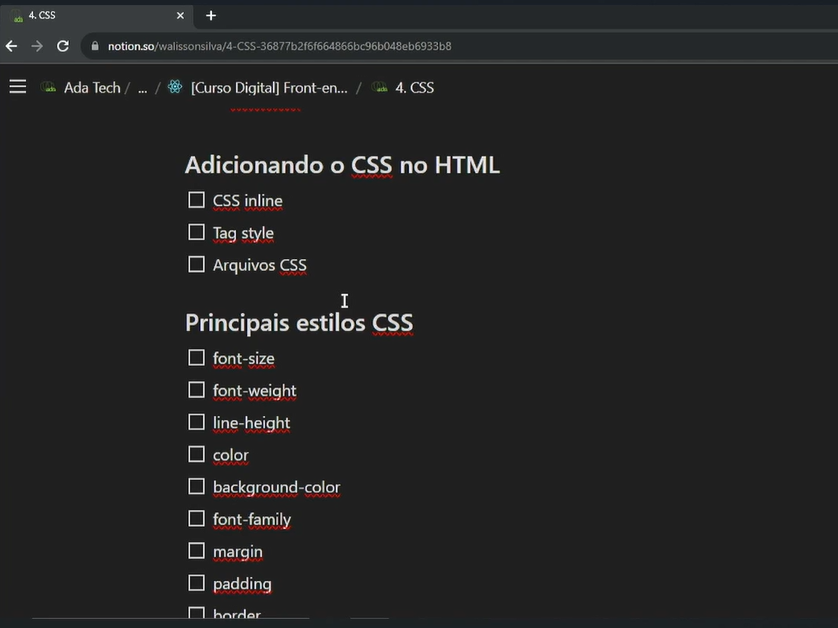
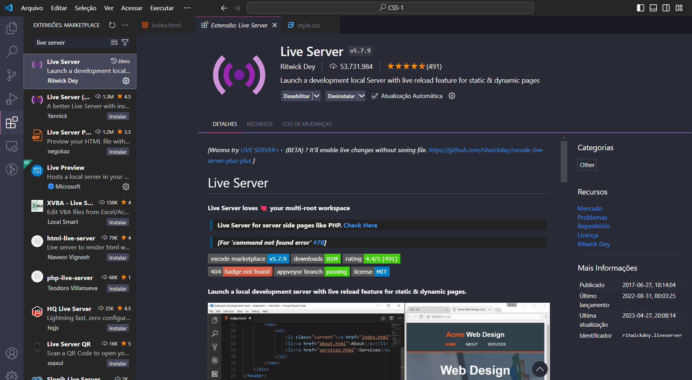

# **4. HTML Layout - CSS**

<!--  -->




```
<!DOCTYPE html>
   <html lang="pt-br">
   <head>
      <meta charset="UTF-8">
      <meta name="viewport" content="width=device-width, initial-scale=1.0">
      <title>Aula 04 - CSS</title>
   </head>

   <body>
      <h1 style="color: red; font-size: 40px;"> Aula 04 - CSS </h1>
      <p>Lorem ipsum dolor sit amet consectetur adipisicing elit. Optio facere libero maiores? Autem, nam numquam.
         Dolorum, incidunt porro fuga ex recusandae fugit tempora, maxime praesentium, cumque perferendis explicabo
         placeat ab.</p>
      <p style="font-size: 22px;">Lorem ipsum dolor sit amet consectetur adipisicing elit. Nesciunt facilis amet nemo.
         Quibusdam expedita aliquam eaque voluptates quidem sit totam, reiciendis provident dolor modi obcaecati error
         suscipit magnam minima officiis.</p>
   </body>
</html>
```

#### **Obs.:**

Estilo aplicado direto na tela é chamado de inline

```
<!DOCTYPE html>
<html lang="pt-br">

<head>
    <meta charset="UTF-8">
    <meta name="viewport" content="width=device-width, initial-scale=1.0">
    <title>Aula 04 - CSS</title>
    <style>
        h1 {
            font-size: 80px;
            color: blue;
        }

        p {
            font-size: 22px;
        }
    </style>
</head>

<body>
    <h1> Aula 04 - CSS </h1>
    <br><br>
    <h2>Subtítulo</h2>
    <p>Lorem ipsum dolor sit amet consectetur adipisicing elit. Optio facere libero maiores? Autem, nam numquam.
        Dolorum, incidunt porro fuga ex recusandae fugit tempora, maxime praesentium, cumque perferendis explicabo
        placeat ab.</p>
    <p>Lorem ipsum dolor sit amet consectetur adipisicing elit. Nesciunt facilis amet nemo.
        Quibusdam expedita aliquam eaque voluptates quidem sit totam, reiciendis provident dolor modi obcaecati error
        suscipit magnam minima officiis.</p>
</body>
</html>
```

#### =============================================================================

```
<!DOCTYPE html>
<html lang="pt-br">

<head>
    <meta charset="UTF-8">
    <meta name="viewport" content="width=device-width, initial-scale=1.0">
    <title>Aula 04 - CSS</title>
    <link rel="stylesheet" href="css/styles.css">
</head>

<body>
    
   <head>
	<h1 class="title">Aula 04 - CSS</h1>
   </head>

    <main>  
        <section id="principais-estilos">
            <h2>Principais Estilos CSS</h2>
            <p class="paragrafo">Lorem ipsum dolor sit amet <strong>consectetur adipisicing</strong> elit. Optio facere
                libero maiores? Autem, nam numquam.
                Dolorum, incidunt porro fuga ex recusandae fugit tempora, maxime praesentium, cumque perferendis
                explicabo
                placeat ab.</p>
            <p class="paragrafo">Lorem ipsum dolor sit amet consectetur adipisicing elit. Nesciunt facilis amet nemo.
                Quibusdam expedita aliquam eaque voluptates quidem sit totam, reiciendis provident dolor modi obcaecati
                error
                suscipit magnam minima officiis.</p>
            <p>Outro parágrafo.</p>
        </section>

        <section id="flexbox">
            <h2>Flexbox</h2>
            <p>Isso aqui é a seção sobre Flexbox</p>
            <div class="container">
                <div class="box"></div>
                <div class="box2"></div>
                <div class="box"></div>
                <div class="box2"></div>
            </div>
        </section>

        <section id="grid-layout">
            <div class="container-grid">
                <div class="caixa"></div>
                <div class="caixa"></div>
                <div class="caixa"></div>
                <div class="caixa"></div>
                <div class="caixa"></div>
                <div class="caixa"></div>
            </div>
        </section>
    </main>
    <footer></footer>
</body>
</html>
```

#### **CSS: Cascading Style Sheets**

```
/*CSS: Cascading Style Sheets*/

/*h1 {
    font-size: 80px;
    color: blue;
}

p {
    font-size: 22px;
}*/

/* #principais-estilos{
    background-color: black;
    color: white;
} */

.title {
    font-size: 50px;
    font-weight: 700;
}

section#principais-estilos {
    background-color: black;
    color: white;
    padding: 50px;
    /*espaçamento externo*/
    margin: 40px;
    border: 5px solid red;
    border-radius: 10px;
    /*deixar arredondada*/
}

/* #principais-estilos p{
    font-size: 22px;
} */

#principais-estilos .paragrafo {
    font-size: 22px;
    line-height: 1.2;
    /*espaçamento de linhas*/
    color: yellow;

    font-family: 'Times New Roman', Times, serif;
}

#flexbox .container {
    display: flex;
    /*deixando os elementos ou caixinhas lado a lado*/
    flex-direction: row;
    /* mostra as caixinhas na mesma linha*/
    /*flex-direction: column;*/
    /*Mostra as caixinhas por coluna*/
    /*justify-content: center;*/
    /*Alinhamento horizontal*/
    /*justify-content: space-evenly;*/
    justify-content: space-between;
    gap: 20px;
    /*espaço entre as caixinhas*/
    /*align-items: flex-start;*/
    /*alinhar na vertical*/
    /*algap: 20px; /*espaço entre as caixinhas*/
    /*align-items: flex-end;*/
    /*alinhar na parte de baixo*/
    align-items: center;
}

#flexbox .container .box {
    width: 200px;
    height: 200px;
    background-color: green;
}

#flexbox .container .box2 {
    width: 200px;
    height: 400px;
    background-color: brown;
}

section#grid-layout {
    margin-top: 50px;
}

#grid-layout .container-grid {
    display: grid;
    /*grid-template-columns: 200px 200px 200px;*/
    /*grid-template-columns: repeat(5, 200px);*/
    grid-template-columns: repeat(5, 1fr);
    gap: 20px;
    /*espaço entre as caixinhas*/
}

#grid-layout .container-grid .caixa {
    width: 200px;
    height: 200px;
    background-color: blueviolet;
}

```

<br><br>

# **Exercicíos 4**

<br>

## **Questão 1**

Sobre o Flexbox, verifique quais afirmativas abaixo são verdadeiras (V)
e quais são falsas (F). Em seguida, assinale a alternativa correta.

1.  O valor padrão do flex-direction é row.

2.  O valor padrão do justify-content é flex-start.

3.  O valor padrão do flex-direction é initial.

4.  O valor padrão do align-items é stretch.

5.  O valor padrão do gap é 20px.

a\) V V F V V

b\) V V F F V

c\) V V F F F

d\) V F F V F

**Alternativa correta é a letra C).**

<br>

## **Questão 2**

Qual das seguintes propriedades CSS é usada para definir o tamanho da
margem interna ao redor do conteúdo de um elemento?

a\) padding

b\) margin

c\) border

d\) spacing

**Alternativa correta é a letra A).**

b\) A propriedade margin representa o espaçamento externo ao elemento.

c\) A propriedade border é utilizado para definir uma borda no elemento.

d\) A propriedade spacing não existe no CSS.

<br>

## **Questão 3**

A propriedade margin pode ser especificada usando um, dois, três ou
quatro valores. Ao definir 2 valores para a propriedade margin de um
elemento (margin: 2rem 4rem), o que cada um dos valores significa?

a\) Significa que o primeiro valor é aplicado aos lados esquerdo e
inferior, e o segundo aos lados direito e superior.

b\) Significa que o primeiro valor é aplicado aos lados superior e
esquerdo, e o segundo aos lados inferior e direito.

c\) Significa que o primeiro valor é aplicado aos lados superior e
inferior, e o segundo aos lados esquerdo e direito.

d\) Significa que o primeiro valor é aplicado aos lados esquerdo e
direito, e o segundo aos lados superior e inferior.

**Alternativa correta é a letra C).**